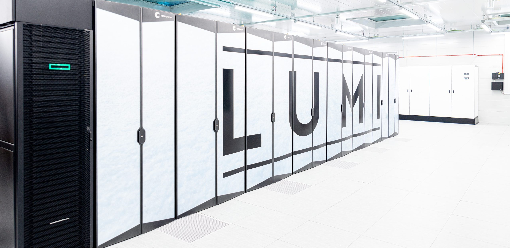

# Planning a resource application
<div class=column>

- Your code is
    - Written/ported &checkmark;
    - Parallelised &checkmark;
    - Optimised &checkmark;
    - Tested, verified, and validated &checkmark;
    - Using robust version control and software engineering practices &checkmark;
</div>

<div class=column>
- Now let's do some science with it! 
- How to run the code on large machines?


</div>


# Accessing top-tier computing resources
- Access even to Tier-0 supercomputers is usually **free for academic users**
- No free lunch though – it is a **competitive** process!
- Various national and international organisations, in particular:

<div class=column style=width:35%>

</div>

<div class=column style=width:55%>

</div>


# HPC organisations
<div class=column style=width:49%>
- CSC – IT Center for Science Ltd.
   - Est. 1971, Espoo & Kajaani
   - Non-profit state enterprise (70% state, 30% HEI)
   - Free-of-charge for Finnish academic users


</div>

<div class=column style=width:49%>
- The European High Performance Computing Joint Undertaking
   - 38 participating states
   - 19 AI factories
   - 14 supercomputers
   - 10 quantum computers


</div>


# Application types
- **CSC academic projects** – Finnish HEIs and state research institutes
   - National infrastructure (Roihu, Pouta, Allas, ...)
   - LUMI through Finnish allocation
- **EuroHPC** – students, researchers, businesses from eligible countries
   - Any EuroHPC system (LUMI, MareNostrum5, Jupiter, ...) 
   - **Development** – get your code up to speed (~4000 node-h)
   - **Benchmark** – prove it runs well at scale (~2000 node-h)
   - **Regular** – large-scale campaign (up to ~200,000 node-h)
   - **Extreme** – hero runs (beyond ~200,000 node-h)
- Pilot – new machines, for the brave
- (Check your national-level options!)


# Application contents
- Solid science (or business) case – **explained clearly**
   - Technical reviewers will likely only be from the broad field (physics, biology, ...)
   - Scientific reviewers will not be as close to your topic as in a journal review
- Demonstrate **technical expertise**
   - Know how to run the code!
- Demonstrate **good performance** of the code
   - More on this in a moment
- Have a clear picture of data amounts and flow – **Data Management Plan**


# Procedure
<div class=column style=width:42%>
- **Application** and review
   - Technical evaluation
   - Scientific review
   - Ranking, decision (sometimes rebuttal)
- Project setup
- **Project operations**
- Reporting
- **Acknowledgement** in research outputs
</div>

<div class=column style=width:56%>

</div>


# Performance properties – on 'paper'

How do you ensure your **code is performing well** and not wasting these precious resources?

Step 0: study the computing centre's recommendations

- **Hardware** properties
   - Number of threads, tasks, GPUs, ... 
   - Memory size and layout
   - Network layout and properties
- **Software** stack
   - Compiler families and versions
   - MPI implementations and versions
   - Useful libraries


# Performance properties – in practice
- Determine the **optimal distribution of tasks and threads**, binding, etc.
- Use a small but **representative setup**
- Proceed systematically
- **Record your findings** for future reference
- Investigate if something feels off


# Example: task – thread balance on 10 nodes
<div class=column style=width:35%>
- Hybrid MPI-OpenMP application on Roihu CPU
- Full node (384 cores)
- All combinations of $$n_\mathrm{tasks} \times n_\mathrm{threads} = 384$$
</div>

<div class=column style=width:63%>

</div>


# Performance properties – intranode optimisation
<div class=column style=width:49%>
- Hardware complexity
   - Deep memory hierarchy
   - CPU clock scaling
- Requires detailed investigations
   - Task – thread balance
   - Profiling
   - Compiler options
- What limits your application?
   - Computation
   - Communication
   - Memory access
</div>

<div class=column style=width:49%>
- HPC centres sometimes offer advanced node-level optimisation courses for their architecture
- Can be very complex!
</div>


# Perfomance properties – scaling
How efficiently is your code running in parallel?

- Weak scaling:
    - Start with a problem run on a single core/CPU/GPU/node
    - **Multiply** both **problem size** and core/CPU/GPU/node count by $n$
    - Plot execution time vs. problem size: **should be flat**
- Strong scaling:
    - Start with problem run on a small amount of resources
    - Run **fixed problem size** with increasing amount of resources
    - Plot execution time vs. amount of resources used: **should be inversely proportional**


# Example – weak scaling
<div class=column>
{.center width=100%}
</div>

<div class=column>
{.center width=100%}
</div>

# Example – strong scaling
<div class=column>
{.center width=100%}
</div>

<div class=column>
{.center width=100%}
</div>


# General workflows
- Many different ways of using HPC
- Common steps/workflows:
   - Building and testing
   - Preparing the job
   - Data flow, in and out
   - Profiling and monitoring
   - Troubleshooting


# Building and testing
- Almost always based on **modules**
- If lucky, `module load <my-software>`
- **Dependencies**: load if available, build otherwise
- **Build** your software
- Start with recommended modules and optimisation flags
- Test first that it yields **correct results, then performance**!


# File system and data
- Familiarise yourself with the file system
   - **Layout**: where to put the code & libraries, where to run
   - **Quotas**: how much data, how many files can be stored
   - **Properties**: storage, high parallel performance, node-local, ...
- Set up your file system
   - Folder structure (understandable naming and hierarchy!)
   - Properties (e.g., Lustre striping)
- Prepare/transfer input data
- Plan timely **data transfer** out


# Job input and output
- Prepare **configuration files** and **input data**
- Prepare **job scripts**
- Plan **documentation** of your run campaign
   - Archive code versions, inputs, configurations
   - Keep all logs and system output/error files
   - Keep track of phases, changes, incidents
- Plan **post-run** steps
   - Analysis
   - Transfers, backups, metadata and data archival

# Example job script recording run settings
```bash
#SBATCH <...>
# record job script
cp $0 job_script_${0}_$SLURM_JOBID
# record environment
env > job_env_$SLURM_JOBID
# record modules
module list > job_modules_$SLURM_JOBID
# record code version
srun -n 1 my_code --version > job_version_$SLURM_JOBID
```


# Start the job!
- Submit your job(s) to the queueing system!
- Patience...
   - `squeue --me`
   - `squeue --me  -o "%F %t %S %u %j %Z"` <br>
     `ARRAY_JOB_ID ST START_TIME USER NAME WORK_DIR`
   - `sinfo`


# Code runs! – Profiling & monitoring
- Detailed performance analysis usually has overheads incompatible with production performance
- It can be useful to **monitor** some metrics with lightweight tools
    - Ensure the code and the system work as intended
- 'Basic' health checks:
    - Is the job proceeding (not hanging)?
    - Is the performance as expected and homogeneous (no unexplained slowdowns)?
    - Is the memory usage as expected (resident, high-water mark)?
    - Is there enough disk quota?


# Code runs! Monitoring & automatising
- **Production campaigns** can be long and frustrating
    - Long queueing times
    - System downtimes
    - Hardware and software failures (the more nodes used, the more frequent!)
- **Streamline and automatise** procedures as much as possible!
    - Automatised workflows
    - Automatic warnings from system
        - slurm email if available (not on LUMI...)
        - Use available APIs to push notifications
- **Do not spend 24/7 on the command line!**


# Troubleshooting
- In case of anomalies:
    - Is my **code version** correct?
    - Are my **compilation** parameters correct? Maybe recompile?
    - Is my **job script** correct and up to date (run parameters, modules)?
    - Check your **workflow** still matches best practices in the documentation!
    - Ask your **team** colleagues to check if things work for them?
- If you suspect system issues:
    - Is a maintenance announced/under way?
    - Is there an update on the system status page or mailing list?
    - Is anyone else running/in queue?


# In case of trouble: get help!
- If you still suspect issues with the system or how you use it, **contact support**!
    - Detailed description!
    - Code, modules, job parameters
    - Expected result/behaviour
    - What is abnormal


# Conclusions 
- Know and make use of the access paths available to obtain HPC resources
- Familiarise yourself well with the system you are running on
- Test thoroughly before committing large resources 
- Adopt practices and tools to ease the burden of a single person

# ...and lastly:

<div class=column style=width:45%>
**Have great success running your well-designed application on top supercomputers!**
</div>

<div class=column style=width:43%>

</div>


