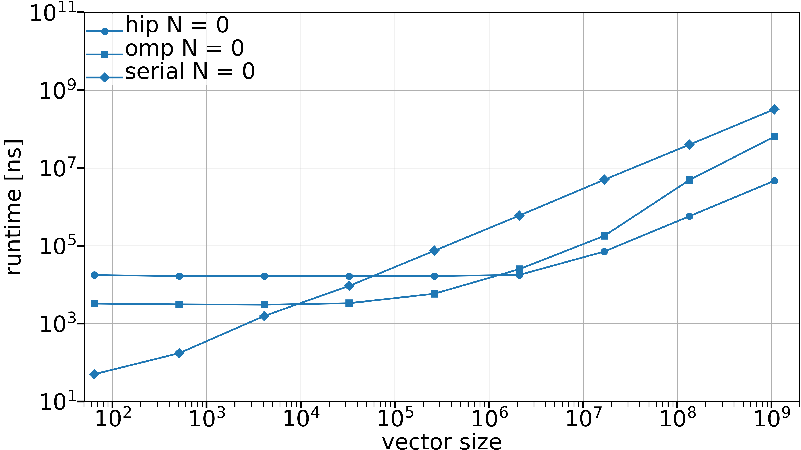
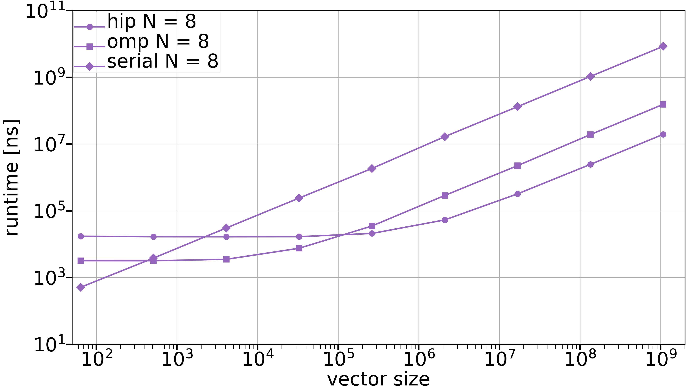
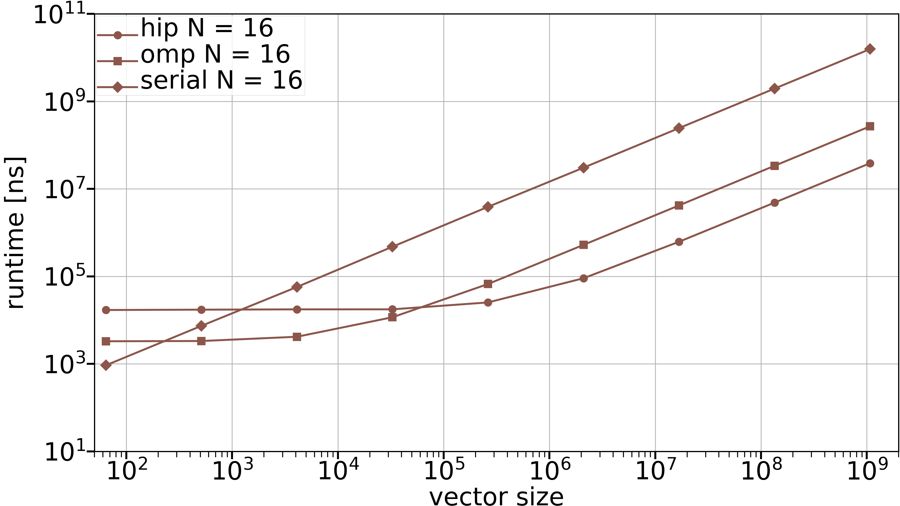
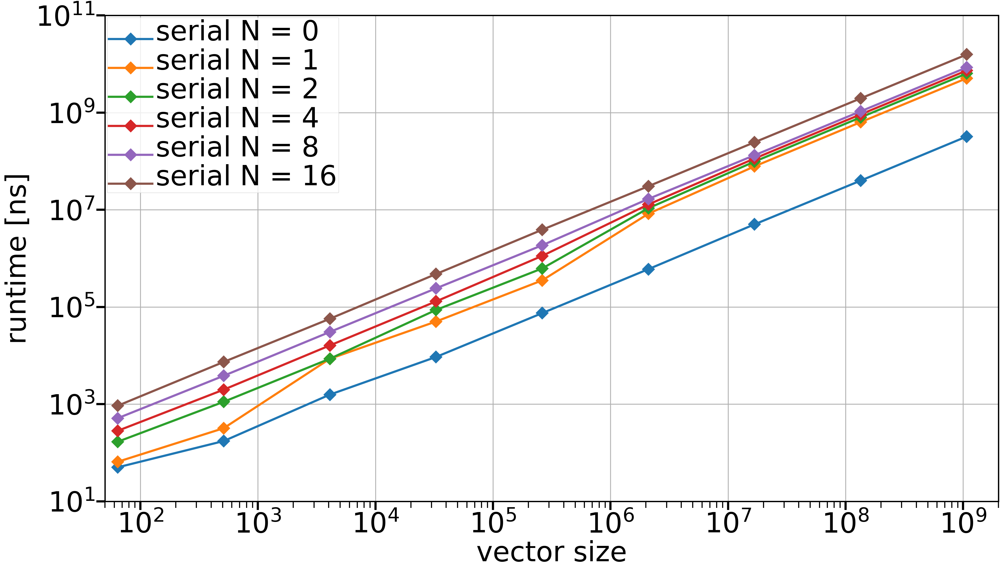
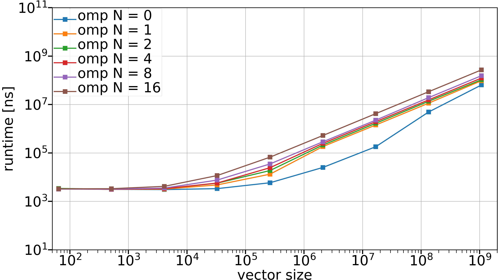
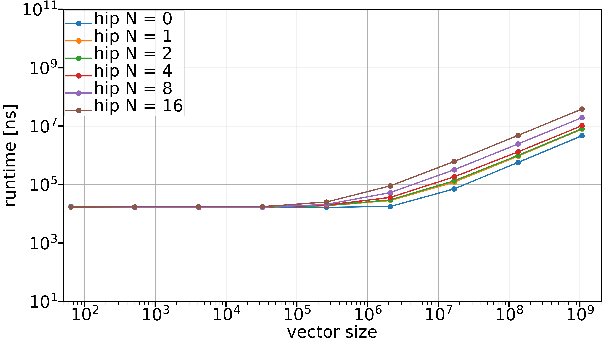
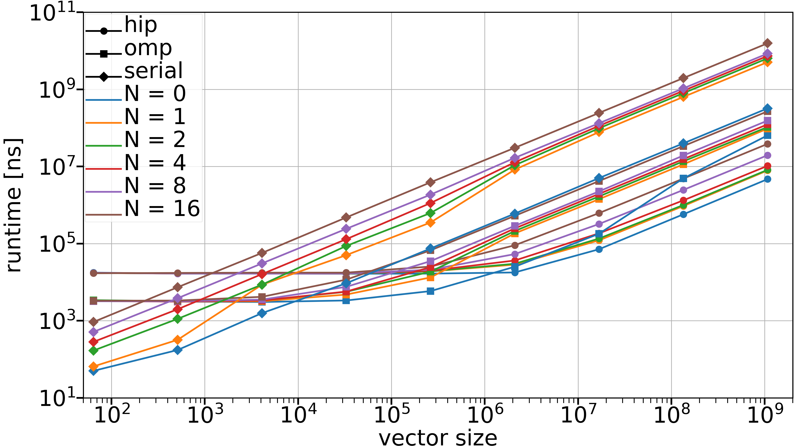
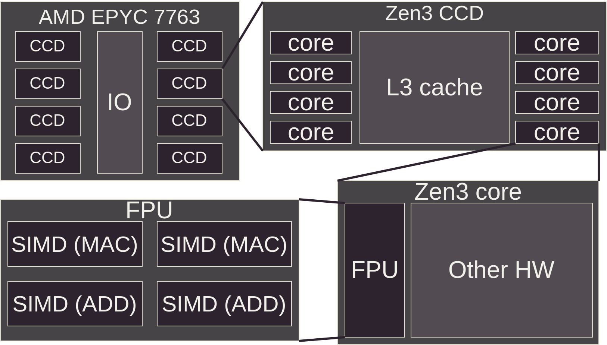
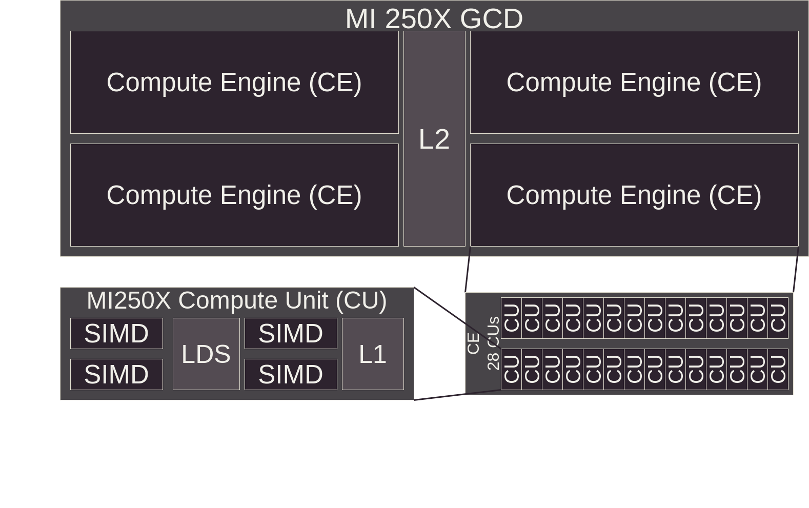

# Overview

We will cover the following topics
  \
  \

- What is a GPU and why should you care
- How does the architecture of a GPU differ from that of a CPU
- What are some of the implications of GPU hardware
- How to use GPUs
- What problems are a good fit for GPUs

# Learning objectives

After this lecture you will understand
  \
  \

- Why GPUs are relevant for HPC
- How GPUs differ from CPUs
- How programming GPUs differs from programming CPUs
- How GPUs can be utilized
- What problems map well to GPUs

# GPUs: why? {.section}

# Why use GPUs for HPC?

:::::: {.columns}
::: {.column width="30%"}

Top 500 supercomputers mapped by coprocessor type.

https://www.top500.org/statistics/treemaps/

:::
::: {.column width="70%"}

November 2005

{.center width=100%}

:::
::::::

# Why use GPUs for HPC?

:::::: {.columns}
::: {.column width="30%"}

Top 500 supercomputers mapped by coprocessor type.

https://www.top500.org/statistics/treemaps/

:::
::: {.column width="70%"}

November 2010

{.center width=100%}

:::
::::::

# Why use GPUs for HPC?

:::::: {.columns}
::: {.column width="30%"}

Top 500 supercomputers mapped by coprocessor type.

https://www.top500.org/statistics/treemaps/

:::
::: {.column width="70%"}

November 2015

{.center width=100%}

:::
::::::

# Why use GPUs for HPC?

:::::: {.columns}
::: {.column width="30%"}

Top 500 supercomputers mapped by coprocessor type.

https://www.top500.org/statistics/treemaps/

:::
::: {.column width="70%"}

November 2020

{.center width=100%}

:::
::::::

# Why use GPUs for HPC?

:::::: {.columns}
::: {.column width="30%"}

Top 500 supercomputers mapped by coprocessor type.

https://www.top500.org/statistics/treemaps/

:::
::: {.column width="70%"}

November 2025

{.center width=100%}

:::
::::::

# Why use GPUs for HPC?

  \
  \
  \

<div style="text-align:center;">
GPUs enable exascale ($10^{18}$ FLOPS)
</div>

# Runtimes of Taylor expansion, N = 0

::::::::: {.columns}
:::::: {.column width="40%"}

- $y_i \gets \sum_{n = 0}^{0} \frac{x_i^n}{n!}$
- $i = 1\dots$ vector size
- No arithmetic: $y_i \gets 1$
- Serial, OpenMP with 64 threads and GPU

::::::
:::::: {.column width="80%"}
{.center width=200%}
::::::
:::::::::

# Runtimes of Taylor expansion, N = 8

::::::::: {.columns}
:::::: {.column width="40%"}

- $y_i \gets \sum_{n = 0}^{8} \frac{x_i^n}{n!}$
- $i = 1\dots$ vector size
- Serial, OpenMP with 64 threads and GPU

::::::
:::::: {.column width="80%"}
{.center width=120%}
::::::
:::::::::

# Runtimes of Taylor expansion, N = 16

::::::::: {.columns}
:::::: {.column width="40%"}

- $y_i \gets \sum_{n = 0}^{16} \frac{x_i^n}{n!}$
- $i = 1\dots$ vector size
- Serial, OpenMP with 64 threads and GPU

::::::
:::::: {.column width="80%"}
{.center width=120%}
::::::
:::::::::

# Runtimes of Taylor expansion, serial

::::::::: {.columns}
:::::: {.column width="40%"}

- $y_i \gets \sum_{n = 0}^{N} \frac{x_i^n}{n!}$
- $i = 1\dots$ vector size
- Serial

::::::
:::::: {.column width="80%"}
{.center width=120%}
::::::
:::::::::

# Runtimes of Taylor expansion, OpenMP 64 threads

::::::::: {.columns}
:::::: {.column width="40%"}

- $y_i \gets \sum_{n = 0}^{N} \frac{x_i^n}{n!}$
- $i = 1\dots$ vector size
- OpenMP 64 threads

::::::
:::::: {.column width="80%"}
{.center width=120%}
::::::
:::::::::

# Runtimes of Taylor expansion, GPU

::::::::: {.columns}
:::::: {.column width="40%"}

- $y_i \gets \sum_{n = 0}^{N} \frac{x_i^n}{n!}$
- $i = 1\dots$ vector size
- GPU

::::::
:::::: {.column width="80%"}
{.center width=120%}
::::::
:::::::::

# Runtimes of Taylor expansion, all

::::::::: {.columns}
:::::: {.column width="40%"}

- $y_i \gets \sum_{n = 0}^{N} \frac{x_i^n}{n!}$
- $i = 1\dots$ vector size
- All

::::::
:::::: {.column width="80%"}
{.center width=120%}
::::::
:::::::::

# CPU vs GPU: what's the difference? {.section}

# What is a GPU?

:::::: {.columns}
::: {.column width="40%"}
A GPU is a **coprocessor** to the CPU

It has its own architecture (and often its own memory)

Examples

- Grace-Hopper
- A100 w/ CPU
- MI250X w/ CPU
:::
::: {.column width="60%"}

CPU and GPU on separate chips

{.center width=120%}
  
:::
::::::

# What is a GPU?

:::::: {.columns}
::: {.column width="40%"}
A GPU is a **coprocessor** to the CPU

It has its own architecture (and often its own memory)

Examples

- MI300A
:::
::: {.column width="60%"}

CPU and GPU on a single chip

{.center width=60%}
  
:::
::::::

# What is a GPU?

- Controlled via an API
- CPU acts as an orchestrator
- GPU executes parallel tasks dispatched by the CPU
- GPUs are **coprocessors**, not replacements of CPUs

{.center width=100%}

# CPU architecture

:::::: {.columns}
::: {.column width="30%"}
Abstract schematic of Epyc 7763 CPU
:::
::: {.column width="70%"}
{.center width=120%}
:::
::::::

# CPU architecture

:::::: {.columns}
::: {.column width="30%"}
Die shot of Zen3 CCD by Fritzchen Fritz

<small>Fritzchens Fritz, public domain, https://www.flickr.com/people/130561288@N04/</small>
:::
::: {.column width="70%"}
{.center width=100%}
:::
::::::

# GPU architecture

:::::: {.columns}
::: {.column width="30%"}
Abstract schematic of MI250x GPU
:::
::: {.column width="70%"}
{.center width=120%}
:::
::::::

# GPU architecture

Die shot of MI250X (on the web page)

https://www.amd.com/en/technologies/cdna.html#cdna2

# CPU vs GPU threads

GPU code is usually written from the perspective of a single GPU thread

Notice the lack of any for loops

```c++
__global__ void saxpy(int n, float alpha, float *x, float *y) {
    // What is my global thread ID?
    const int tid = blockIdx.x * blockDim.x + threadIdx.x;

    // Is my thread ID smaller than the length of the array?
    if (tid < n) {
        // Perform the operation, for this single ID
        y[tid] = alpha * x[tid] + y[tid];
    }
}
```

# CPU vs GPU threads -- Very different beasts

:::::: {.columns}
::: {.column width="50%"}
GPU threads

- Very lightweight: cheap to switch
- $N_{thr} = O(N_{data}) \approx 10^4 - 10^6$
- Spawned automatically during kernel launch
- Threads grouped hiearchically
- Mapped to lanes of a SIMD unit

:::
::: {.column width="50%"}
CPU threads

- Context switch a heavy operation
- $N_{thr} = O(N_{core}) \approx 10^1 - 10^2$
- Spawned by the user/library
- Threads can work independently
- Mapped to cores
:::
::::::

# CPU vs GPU threads -- Keeping HW busy

:::::: {.columns}
::: {.column width="50%"}
GPU

- Launch many threads to oversubscribe hardware
- In case of a stall, context switch to another thread to keep working

:::
::: {.column width="50%"}
CPU

- Launch few threads: 1-2 per core
- Attempt to reduce the number of stalls by any means necessary
  - branch prediction
  - instruction reordering
  - large and sophisticated caches
- As the last resort, context switch to another thread

:::
::::::

# GPU Architecture Implications: Memory Bandwidth

More computing units = higher bandwidth requirement

:::::: {.columns}
::: {.column width="40%"}

- 100s of GB/s (CPU)
- 1000 of GB/s (GPU)
:::
::: {.column width="60%"}

{.center width=120%}
:::
::::::

# GPU Architecture Implications: Parallelism Requirement

- Many parallel execution units require many parallel tasks
- A serial algorithm only uses a fraction of GPU capacity
- Not all problems parallelize easily

# GPU Architecture Implications: High latency, high throughput

- Single value latency high compared to CPU
- With the same latency you get many values --> throughput is high
- CPUs are optimized for low latency, GPUs for high throughput


:::::: {.columns}
::: {.column width="80%"}
{.center width=100%}
:::
::: {.column width="20%"}
  \
  \
  \
Image credit J. Lankinen
:::
::::::

# GPU Architecture Implications: Algorithmic Changes

- Some algorithms need restructuring for GPU efficiency
- Example: Reductions (summing an array)
- CPU: Simple loop with an accumulator

{.center width=100%}

# GPU Architecture Implications: Algorithmic Changes

- GPU: Hierarchical reduction with multiple kernel launches & synchronization

{.center width=100%}

# GPU Architecture Implications: Algorithmic Changes

- Reduction step across a SIMD unit
- Illustrative only, shows how different this is from a serial reduction

:::::: {.columns}
::: {.column width="50%"}
```cpp
// lid (= lane id) goes from 0 to 15
for (auto i = 4; i > 0; i--) {
    const auto off1 = 1 << (i - 1);
    const auto off2 = (lid >> i) << i;
    const auto mod = (1 << i) - 1;
    const auto srclane = ((lid + off1) & mod)
                         + off2;
    value += __shfl(value, srclane);
}
```
:::
::: {.column width="50%"}
{.center width=100%}
:::
::::::

# How to Use a GPU {.section}

TODO: typistetään tämä hyvin yksinkertaiseksi, ks. Jussin kommentit

# How to Use a GPU: Overview

Multiple layers of abstraction:
  \
  \

1. GPU accelerated programs
2. Parallel programming libraries
3. High-level APIs
4. Low-level APIs
5. Assembly-like intermediate representations

# How to Use a GPU: GPU-Accelerated Programs

Use existing HPC software with GPU support

Examples:

- GROMACS -- Molecular dynamics simulations
- LAMMPS -- Molecular dynamics simulations
- Elmer -- CSC's open source Finite Element multi-physics simulation package

# How to Use a GPU: Libraries – Algorithms

rocTHRUST (AMD) / Thrust (NVIDIA)
  \
  \

- Common GPU-accelerated algorithms
- Reductions – Sum, max, min operations
- Scan – Prefix sums and cumulative operations
- Transformations – Apply functions element-wise
- Sorting – Efficient parallel sort implementations

# How to Use a GPU: Libraries – Algorithms

rocTHRUST (AMD) / Thrust (NVIDIA)
  \
  \

- Search – Binary search and set operations
- Remove – Filter elements based on predicates
- Fill/Generate – Initialize GPU memory
- Gather/Scatter – Irregular memory access patterns
- ForEach – Execute function on all elements

# How to Use a GPU: Libraries – Linear Algebra

rocBLAS (AMD) / cuBLAS (NVIDIA)
  \
  \

- GPU implementations of BLAS (Basic Linear Algebra Subprograms)
- Essential for matrix operations
- Compatible with CPU BLAS interface
- Extreme performance for dense matrices

# How to Use a GPU: Libraries – Linear Algebra

rocSOLVER (AMD) / cuSOLVER (NVIDIA)
  \
  \

- GPU implementations of LAPACK routines
- Higher-level solvers (LU, QR, SVD, eigenvalue decomposition)
- Builds on BLAS infrastructure

# How to Use a GPU: Libraries – Linear Algebra

rocSPARSE (AMD) / cuSPARSE (NVIDIA)
  \
  \

- Sparse matrix solvers and operations
- Critical for problems with sparse structure
- Significant memory and compute savings for sparse data

# How to Use a GPU: High-Level APIs – OpenMP offloading

```cpp
#pragma omp target data map(tofrom:a[:N]) map(to:b[:N])
#pragma omp target teams distribute parallel for
for(size_t k = 0; k < N; ++k) {
  a[k] = 1.25 * a[k];
  a[k] += b[k];
}
```

- Works with C/C++/Fortran
- Vendor-supported on NVIDIA and AMD
- Pragmatic approach – annotate parallelizable loops

# How to Use a GPU: High-Level APIs – OpenACC

```fortran
!$acc parallel loop gang vector tile(16,16)
do j=1,n
    do i=1,n
        B(j,i) = A(i,j)
    enddo
enddo
!$acc end parallel
```

- Designed for accelerators
- Primarily Fortran
- NVIDIA has excellent support
- AMD support limited

# How to Use a GPU: High-Level APIs – C++

| Library | Origin | CPU | NVIDIA | AMD | Intel |
|---|---|:---:|:---:|:---:|:---:|
| Kokkos | Sandia / LF | Yes | Yes | Yes | Yes |
| RAJA | LLNL | Yes | Yes | Yes | Partial |
| SYCL | Khronos standard | Yes | Yes | Yes | Yes |

LF: Linux Foundation

LLNL: Lawrence Livermore National Laboratory

# How to Use a GPU: High-Level APIs – C++

<pre class="code"><code class="language-cpp">// Kokkos
<span style="background:#8abeb7">Kokkos::parallel_for</span>("saxpy", <span style="background:#f0c674">Kokkos::RangePolicy&lt;execution_space&gt;(0, N)</span>,
  <span style="background:#c5c8c6">KOKKOS_LAMBDA(const size_type i) {
    y(i) = a * x(i) + y(i);
  }</span>);

// RAJA
<span style="background:#8abeb7">RAJA::forall</span>&lt;Exec_GPU&gt;(<span style="background:#f0c674">RAJA::RangeSegment(0,N)</span>,
  <span style="background:#c5c8c6">[=] RAJA_DEVICE (idx_t i){
    y[i] = a * x[i] + y[i];
  }</span>
);

// SYCL
<span style="background:#8abeb7">h.parallel_for</span>&lt;class saxpy&gt;(<span style="background:#f0c674">sycl::range&lt;1&gt;(N)</span>, <span style="background:#c5c8c6">[=](sycl::id&lt;1&gt; i){
    y[i] = a * x[i] + y[i];
}</span>);
</code></pre>

# How to Use a GPU: High-Level APIs – Python

CuPy

```python
@jit.rawkernel()
def elementwise_copy(x, y, size):
    tid = jit.blockIdx.x * jit.blockDim.x + jit.threadIdx.x
    ntid = jit.gridDim.x * jit.blockDim.x
    for i in range(tid, size, ntid):
        y[i] = x[i]
```

- NumPy-like: accelerate array operations on GPUs
- Also possible to write GPU kernels in Python syntax
- NVIDIA support mature, AMD support experimental

# How to Use a GPU: High-Level APIs – Python

Numba

```python
@cuda.jit
def increment_by_one(an_array):
    tx = cuda.threadIdx.x
    ty = cuda.blockIdx.x
    bw = cuda.blockDim.x
    pos = tx + ty * bw
    if pos < an_array.size:
        an_array[pos] += 1
```

- Write GPU kernels in Python syntax
- Good performance, lower boilerplate than CUDA
- NVIDIA support mature, AMD support experimental

# How to Use a GPU: High-Level APIs – Python

PyTorch

```python
dtype = torch.float
device = torch.device("cuda:0")

x = torch.linspace(-math.pi, math.pi, 2000, device=device, dtype=dtype)
y = torch.sin(x)
z = x + y
```

- Versatile beyond ML (general tensor operations)
- Ok-ish performance for general purpose computation
- Mature support from AMD and NVIDIA

# How to Use a GPU: Lower-Level APIs – CUDA & HIP

CUDA (NVIDIA)

```c++
__global__ void saxpy(int n, float alpha, float *x, float *y) {
    int tid = blockIdx.x * blockDim.x + threadIdx.x;
    if (tid < n) {
        y[tid] = alpha * x[tid] + y[tid];
    }
}
```

- NVIDIA GPUs only
- C/C++/Fortran support
- Most mature ecosystem and documentation

# How to Use a GPU: Lower-Level APIs – CUDA & HIP

HIP (AMD/NVIDIA)

```c++
__global__ void saxpy(int n, float alpha, float *x, float *y) {
    int tid = blockIdx.x * blockDim.x + threadIdx.x;
    if (tid < n) {
        y[tid] = alpha * x[tid] + y[tid];
    }
}
```

- Heterogeneous-Compute Interface for Portability by AMD
- Syntactically almost 1 to 1 match with CUDA
- Makes code reuse across vendors easier
- Uses CUDA on NVIDIA GPUs, ROCm on AMD GPUs

# How to Use a GPU: Lower-Level APIs – OpenCL

OpenCL

```c++
__kernel void saxpy(int n, float alpha, __global float* x, __global float* y) {
    int i = get_global_id(0);
    if (i < n) {
        y[i] = alpha * x[i] + y[i];
    }
}
```

- Open standard maintained by Khronos Group
- Vendor agnostic, runs on GPUs, CPUs and other devices
- Not well supported on newer GPUs

# How to Use a GPU: Lower-Level APIs – Triton

Triton (Python-like)

```python
@triton.jit
def saxpy(y_ptr, x_ptr, alpha, n, BLOCK_SIZE: tl.constexpr):
    block_id = tl.program_id(axis=0)
    block_start = block_id * BLOCK_SIZE
    offsets = block_start + tl.arange(0, BLOCK_SIZE)
    mask = offsets < n
    x = tl.load(x_ptr + offsets, mask=mask)
    y = tl.load(y_ptr + offsets, mask=mask)
    y_new = alpha * x + y
    tl.store(y_ptr + offsets, y_new, mask=mask)
```

- Python-like GPU programming language from OpenAI
- Mostly used in AI/ML context
- Can be use for general purpose computing


# How (NOT) to Use a GPU: Assembly-like languages -- PTX

PTX – NVIDIA Parallel Thread Execution

```ptx
{
	ld.param.u64 	%rd1, [square(int*, int)_param_0];
	ld.param.u32 	%r2, [square(int*, int)_param_1];
	mov.u32 	%r3, %ntid.x;
	mov.u32 	%r4, %ctaid.x;
	mov.u32 	%r5, %tid.x;
	mad.lo.s32 	%r1, %r3, %r4, %r5;
	setp.ge.s32 	%p1, %r1, %r2;
}
```

- Used internally by NVCC compiler
- Don't write by hand, unless you know you need to

# How (NOT) to Use a GPU: Assembly-like languages -- HSAIL

HSAIL – Heterogeneous System Architecture Intermediate Language

```hsail
shl_u32 $s1, $s1, 2;
add_u32 $s2, $s2, $s1;
ld_global_f32 $s2, [$s2];
add_u32 $s3, $s3, $s1;
ld_global_f32 $s3, [$s3];
add_f32 $s2, $s3, $s2;
add_u32 $s0, $s0, $s1;
st_global_f32 $s2, [$s0];
```

- AMD's compiler target representation
- Don't write by hand, unless you know you need to

# How to Use a GPU: Graphics APIs

General-purpose compute via compute pipeline and compute shaders
  \
  \

- DirectX – Windows/Xbox, C++ with HLSL shaders
- Vulkan – Cross-platform, C/C++/Rust with GLSL/SPIR-V
- Metal – Apple platforms, Swift/Objective-C with MSL

Poor support on supercomputers (drivers missing)

# How to Use a GPU: Language Support Summary

| Language | NVIDIA | AMD |
|----------|--------|-----|
| C/C++ | Excellent | Excellent |
| Fortran | Good | Limited |
| Python | Good | Limited |
| Other | Varies | Varies |

# How to Use a GPU: Practical Language Guidance

Choose based on your needs:

- C/C++
    - Maximum portability and vendor support
- Python
    - Rapid development, strong ML frameworks
    - Numba & CuPy experimental support on AMD
- Fortran
    - Legacy and scientific codes
    - NVIDIA support better
- Other languages
    - Possible but support usually lacking on HPC systems

# Problems That Map Well to GPUs {.section}

# Problem Characteristics: Low Coupling & Parallelism

:::::: {.columns}
::: {.column width="50%"}
Problems with low coupling and many independent elements

Examples

- For loops with independent iterations
- Reductions (e.g. sums, max operations) across large arrays
- Matrix/vector products with many vectors/large matrices

:::
::: {.column width="50%"}
```cpp
for (auto i = 0; i < N; i++) {
    y[i] = a * x[i] + y[i];
}
```
{.center width=100%}
:::
::::::

# Problem Examples: Particle Simulations

:::::: {.columns}
::: {.column width="50%"}
Particle systems with limited coupling

Examples

- Molecular dynamics with cutoff distances
- N-body problems with approximate forces
:::
::: {.column width="50%"}
{.center width=100%}
<small>Semen Yesylevskyy, CC BY 4.0 <https://creativecommons.org/licenses/by/4.0>, via Wikimedia Commons</small>
:::
::::::

# Problem Examples: Grid-Based Simulations

:::::: {.columns}
::: {.column width="50%"}
Grid-based systems where cells are updated independently

Examples

- Lattice-Boltzmann Methods
- Cellular automata (Conway's Game of Life)
:::
::: {.column width="50%"}
{.center width=100%}
:::
::::::

# Problem Examples: Shading & Image Processing

:::::: {.columns}
::: {.column width="50%"}
Image processing

Examples

- Rendering 2D/3D scenes (original purpose of GPUs)
- Image filters (convolutions, blur, edge detection)

:::
::: {.column width="50%"}
{.center width=100%}

<small>Barahag, CC BY-SA 4.0 <https://creativecommons.org/licenses/by-sa/4.0>, via Wikimedia Commons</small>
:::
::::::

# Problem Examples: Machine Learning & AI

:::::: {.columns}
::: {.column width="50%"}
ML & AI with matrix operations & data parallelism

Examples

- natural language processing
- computer vision

:::
::: {.column width="50%"}
{.center width=100%}

<small>Max Gruber, CC BY 4.0 <https://creativecommons.org/licenses/by/4.0>, via Wikimedia Commons</small>
:::
::::::

# Does your problem benefit from a GPU?

Ask yourself
  \
  \

1. Does my problem have many parallel tasks?
2. Do I have a lot of data to crunch over?
3. Can I minimize CPU <--> GPU data movement?
4. Do I need low latency or high throughput?

# How to approach using GPUs?

1. Is software available? (GROMACS, LAMMPS, Elmer)
2. Can I use generic libraries? (Thrust, rocBLAS)
4. Do I need portability, ease of development, efficiency, feature support?
5. Lower level API with maximum control or a higher level abstraction?

# Summary

- The top 500 supercomputers gain their power from GPUs
- HPC programming changes rapidly, 5 years is a long time in HPCland
- GPUs are optimized for maximum throughput, not low latency
- Think about your needs when choosing the abstraction level:
  - High-level libraries (more assumptions, less control)
  - Low-level APIs (more explicit, maximum control)
- C/C++ best supported across NVIDIA and AMD
- Many problems map well to the parallel nature of GPUs, but not all

# Questions?

# The End

Thank you, bye
