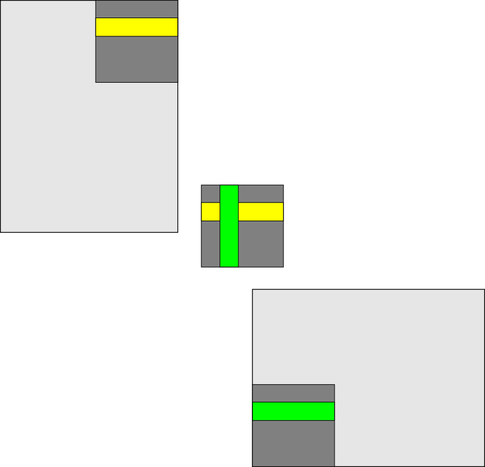

# Overview

- General optimisation strategies
- Optimizing memory access
- Other GPU kernel optimisations

# Measuring performance

- Before starting any performance optimisation one needs to find out the current bottlenecks and where they occur
- Typical bottlenecks
    - host-device data transfers
    - too little parallelism for GPUs
    - unoptimal memory access
    - unoptimal kernel code

# Performance analysis tools

- Applications own timing information
    - can be useful for big picture
    - GPU execution is asynchronous, remember to synchronize or use events
- Performance analysis tools
    - provide detailed information about the application
    - find hot-spots (functions and loops)
    - identify causes of less-than-ideal performance
    - information about low-level hardware via performance counters
- ROCProfiler and ROCm Compute Profiler, Nsight Systems and Nsight Compute
- ScoreP, TAU, ...


# Timers in application

- As GPU kernels are run asynchronously, timers in application need to use events or explicit 
  synchronization in measurements

<div class="column">
```cpp
hipEventRecord(start);

kernel<<<grid, block>>>(...);

hipEventRecord(stop);

hipEventSynchronize(stop);

float ms = 0.0f;
hipEventElapsedTime(&ms, start, stop);
```
- Measures only the time spent on GPU
</div>
<div class="column">
```cpp
auto start = clock();

kernel<<<grid, block>>>(...);
hipDeviceSynchronize();

auto stop = clock();


float ms = (stop - start) * 1e3;
```
- Measures also kernel launch latency
</div>

# Example: rocprof

<small>
```
$ rocprofv3 ... --summary
ROCPROFV3 SUMMARY:

|                   NAME             |     DOMAIN      | CALLS | DURATION (nsec)| AVERAGE (nsec)| PERCENT (INC)| MIN (nsec)| MAX (nsec)|
|------------------------------------|-----------------|-------|----------------|---------------|--------------|-----------|-----------|
| hipLaunchKernel                    | HIP_API         |     4 |      434203887 |     1.086e+08 |    66.945517 |      4700 | 434182684 |
| hipDeviceSynchronize               | HIP_API         |     4 |       85300133 |     2.133e+07 |    13.151567 |  12483534 |  29194539 |
| hipMalloc                          | HIP_API         |     1 |       44015742 |     4.402e+07 |     6.786343 |  44015742 |  44015742 |
| ternary_kernel(double*, int)       | KERNEL_DISPATCH |     1 |       29183576 |     2.918e+07 |     4.499521 |  29183576 |  29183576 |
| divergence_kernel(double*, int)    | KERNEL_DISPATCH |     1 |       28497647 |     2.850e+07 |     4.393765 |  28497647 |  28497647 |
| no_divergence_kernel(double*, int) | KERNEL_DISPATCH |     1 |       14787390 |     1.479e+07 |     2.279919 |  14787390 |  14787390 |
| singlebranch_kernel(double*, int)  | KERNEL_DISPATCH |     1 |       12472800 |     1.247e+07 |     1.923055 |  12472800 |  12472800 |
| hipFree                            | HIP_API         |     1 |         108380 |     1.084e+05 |     0.016710 |    108380 |    108380 |
| __hipRegisterFatBinary             | HIP_API         |     1 |           9819 |     9.819e+03 |     0.001514 |      9819 |      9819 |
| __hipPushCallConfiguration         | HIP_API         |     4 |           6513 |     1.628e+03 |     0.001004 |       100 |      5431 |
| __hipRegisterFunction              | HIP_API         |     4 |           5250 |     1.312e+03 |     0.000809 |       260 |      4148 |
| __hipPopCallConfiguration          | HIP_API         |     4 |           1784 |     4.460e+02 |     0.000275 |        90 |       871 |

```
</small>

# Optimisation strategies

1. Minimise host-device data transfers
2. Use existing libraries
3. Optimize memory accesses
4. Avoid branching within warp
5. Minimise number of active local variables 


# 1. Host-device data transfers

### Peak theoretical bandwidth

| Link | Host-device | Device memory | 
|------|------------:|--------------:|
| LUMI-G MI250x | 36 GB/s | 1600 GB/s|
| PCIE4.0 x16 | $\sim$ 32 GB/s |  |
| A100 (Mahti) |  | 2000 GB/s |
| GH200(Roihu) | 450GB/s | 4 TB/s |

- Matrix multiplication $C = A \times B$ with 10000 x 10000 matrices in LUMI:
    - Host-to-device memory copies: 0.07 s
    - Computation: 0.04 s

::: notes

- Be afraid of host-device memory copies!
- Be aware of the 2-order of magnitude BW difference
- Try your best to minimize/overlap them
- Exceptions: GH200, MI300A (still there, but lighter penalty)
- GH200 has 900GB/s nominally, but is both direction so 450-450

:::

# 2. Libraries (I)
- Optimized libraries can provide several orders of more performance

<small>
<div class="column">
Naive matrix multiplication
```cpp
__global__ void matmul_kernel(int order, float *A, float *B, float *C)
{
  auto i = blockIdx.x * blockDim.x + threadIdx.x;
  auto j = blockIdx.y * blockDim.y + threadIdx.y;

  if ((i < order) && (j < order)) {
    for(int k = 0; k < order; ++k) {
      C[i+j*order] += A[i + k*order] * B[k + j*order];
    }
  }
}

matmul_kernel<<<dimGrid, dimBlock>>>(order, d_a, d_b, d_c);
```
- 2.8 s (LUMI, order=10 000)
</div>
<div class="column">
Matrix multiplication with hipBLAS
```cpp
  hipblasHandle_t h;
  hipblasCreate(&h);


  hipblasDgemm(h, 
               HIPBLAS_OP_N, HIPBLAS_OP_N,
               order, order, order,
               &alpha,            
               d_a, order,          
               d_b, order,
               &beta, 
               d_c, order);
```
- 0.05 s (LUMI, order=10 000)
</div>
</small>

::: notes

- Before you optimize, use libraries

:::

# 2. Common libraries (I)
| NVIDIA   | HIP       | ROCm       | Description                                                                         |
| -------- | --------- | ---------- | ----------------------------------------------------------------------------------- |
| cuBLAS   | hipBLAS   | rocBLAS    | Basic Linear Algebra Subroutines                                                    |
| cuFFT    | hipFFT    | rocfft     | Fast Fourier Transforms                                                             |
| cuRAND   | hipRAND   | rocRAND    | Random number generation                                                            |
| cuSOLVER | hipSOLVER | rocSOLVER  | Dense and sparse linear algebra (LAPACK)                                            |
| Thrust   |           | rocThrust  | Parallel algorithms (C++ STL-like)                                                  |
| CUB      | hipCUB    | rocPRIM    | Low level parallel primitives                                                       |


# 2. Common libraries (II)

| NVIDIA   | HIP       | ROCm       | Description                                                                         |
| -------- | --------- | ---------- | ----------------------------------------------------------------------------------- |
| cuSPARSE | hipSPARSE | rocSPARSE  | Sparse BLAS + SMV                                                                   |
| AMG-X    |           | rocALUTION | Sparse iterative solvers and preconditioners with Geometric and Algebraic MultiGrid |
| EIGEN    | EIGEN     | EIGEN      | Linear algebra 
| cuDNN    |           | MIOpen     | Deep neural network primitives
| NCCL     |           | RCCL       | multi-GPU communication                                                             |


# 3. Optimize memory accesses: amount of memory operations

- Matrix multiplication: temporary variable avoids K-1 global memory accesses

::::::{.columns}
:::{.column width=49%}
```cpp
  if (x < M && y < N) {
    for(int i = 0; i < K; ++i) {
      C[y+x*M] += A[x + i*M]*B[i + y*K];
    }
  }


```
:::
:::{.column width=49%}
```cpp
  if (x < M && y < N) {
    float tmp(0); 
    for(int i = 0; i < K; ++i) {
      tmp += A[x + i*M]*B[i + y*K];
    }
    C[y+x*M] = tmp;
  }
```
:::
::::::

- Fuse kernels if applicable


# 3. Optimize memory accesses: use the right memory

**Device memory hierarchy**<br>
**Fastest first**

::::::{.columns}
:::{.column width=60%}
- Registers (per-thread-access)
- Shared memory (per-block-access)
- Local memory (per-thread-access)
- Global memory (global access)
:::
:::{.column}
{width=100%}
:::
::::::


# 3. Optimize memory accesses: use the right memory

## Device memory hierarchy

<div class="column">
::: {.fragment}
- Registers (per-thread-access)
    - Used automatically
    - $\sim$ kilobytes
    - Very fast access
:::
::: {.fragment}
- Shared memory (**LDS**, per-block-access)
    - User controlled with `__shared__` keyword
    - $\sim$ kilobytes
    - Fast access
:::
</div>

<div class="column">
::: {.fragment}
- Local memory (per-thread-access)
    - Used automatically if all registers are reserved (register spilling)
    - Local memory resides in global memory
    - Very slow access
:::
::: {.fragment}
- Global memory (per-device-access)
    - Managed by the host with HIP API
    - $\sim$ gigabytes
    - Very slow access
:::
</div>

---

# 3. Optimize memory accesses: Coalesce 

- Device main memory is accessed in batches of 64 or 128 bytes
- If warp requests consecutive elements, hardware can combine (**coalesce**) the requests into 
  fewer transactions

  |  |  |  |
  |--|--|--|
  | stride-1 | "`double val = global_mem[tid]`" | ***fast*** 🐇 |
  | stride-64 |"`double val = global_mem[tid*8]`" | ***slow*** 🐢 |

- Non-linear access is fine as long as the warp as a whole accesses consecutive elements in global memory

---

# Uncoalesced memory access

::::::{.columns}
:::{.column width="50%"}
{width="100%"}
<div align=right>
{width="3cm"}
</div>
:::
:::{.column}

* 6 read operations for 6 elements
```cpp
double val = global_array[8*tid];
```
:::
::::::


---

# Coalesced memory access

::::::{.columns}
:::{.column width="50%"}
{width="100%"} 
<div align=right>
{width="3cm"}
</div>
:::
:::{.column}
* 2 read operations for 16 elements
```cpp
double val = global_array[tid];
```
:::

::::::


---

# Coalesced access with multidimensional thread blocks and grids

- Multidimensional thread blocks and grids have `threadIdx.[x|y|z]`, `blockIdx.[x|y|z]` *etc.*
  indices
- The first index `x` varies fastest contrary to C/C++ multidimensional array ordering
    
<small>
<div class="column">
**Uncoalesced access**
```cpp
__global__ void copy(int width, int height, float *A, float *B)
{
  auto x = blockIdx.x * blockDim.x + threadIdx.x;
  auto y = blockIdx.y * blockDim.y + threadIdx.y;

  auto index = x * height + y;

  B[index] = A[index]
}

```
</div>
<div class="column">
**Coalesced access**
```cpp
__global__ void copy(int width, int height, float *A, float *B)
{
  auto x = blockIdx.x * blockDim.x + threadIdx.x;
  auto y = blockIdx.y * blockDim.y + threadIdx.y;

  auto index = y * width + x;

  B[index] = A[index]
}

```
</div>
</small>

# 3. Optimize memory accesses: use LDS

- Accessing shared memory is faster than the global device memory
- Shared within a block
    - Synchronization with `__syncthreads()`
- Amount of available shared memory depends on the architecture
- Use cases:
  - reduce overlapping global memory operations
  - User controlled cache
  - Transform uncoalesced memory operations to coalesced


# 3. Optimize memory accesses: use LDS 
- Shared memory is declared within the kernel with `__shared__` keyword
- Shared memory can be static or dynamic
    - kernel can have multiple shared memory arrays but only a single dynamic
    - size of the dynamic shared memory is specified in the third argument in the kernel launch `kernel<<<blocks, threads, shmem>>>()`

<small>
<div class="column">
**Static shared memory**
```cpp
__global__ void kernel(...)
{
  __shared__ float buf[256];
  __shared__ int buf2[256];
...
}

kernel<<<blocks, threads>>>(...)
```
</div>
<div class="column">
**Dynamic shared memory**
```cpp
__global__ void kernel(...)
{
  extern __shared__ float buf[];
...
}

size_t shmem = n * sizeof(float) // given to kernel in bytes
kernel<<<blocks, threads, shmem>>>(...)
```
</div>
</small>

---

# Example: Matrix transpose with shared memory (I)

<small>
<div class="column" style=width:55%>
Naive implementation
```cpp
__global__ void transpose_kernel(float *in, float *out, 
                                 int width, int height) {

  int x_index = blockIdx.x * tile_dim + threadIdx.x;
  int y_index = blockIdx.y * tile_dim + threadIdx.y;

  int in_index = y_index * width + x_index;
  int out_index = x_index * height + y_index;

  out[out_index] = in[in_index];
}
```
</div>
<div class="column" style=width:42%>
Either reads or writes are uncoalesced
{.center width=80%}
</div>
</small>

# Example: Matrix transpose with shared memory (II)

<small>
<div class="column" style=width:55%>
Implementation with shared memory
```cpp
__global__ void transpose__kernel(float *in, float *out, 
                                  int width, int height) {

  __shared__ float tile[tile_dim][tile_dim];

  int x_tile_index = blockIdx.x * tile_dim;
  int y_tile_index = blockIdx.y * tile_dim;

  int in_index =
      (y_tile_index + threadIdx.y) * width + (x_tile_index + threadIdx.x);
  int out_index =
      (x_tile_index + threadIdx.y) * height + (y_tile_index + threadIdx.x);

  tile[threadIdx.y][threadIdx.x] = in[in_index];

  __syncthreads();

  out[out_index] = tile[threadIdx.x][threadIdx.y];
}
```
</div>
<div class="column" style=width:42%>
Both reads and writes are coalesced
{.center width=60%}
</div>
</small>

# Other examples where shared memory is important

- Matrix-matrix/vector multiplication
 
  :::{.fragment}
  - Same elements are loaded in different threads
  :::
- N-body problem
 
  :::{.fragment}
  - One thread evolves one body: each thread loads all data of each other body as well
  :::
- Reductions
 
  :::{.fragment}
  - Cooperation between threads
  :::

# 3. Optimize memory accesses: LDS - banked access


::::::{.columns}
:::{.column}
- Example: <br>8 banks, 16 threads
  - Left: 2 bank conflicts per cycle,  use all LDS
  - Right: 8 conflicts per cycle, use $\frac 1 4$ of LDS

- MI250x: 32 banks of 512 dwords
:::
:::{.column}
{width=80%}
:::
:::{.columnn}
{width=23cm}
:::
::::::

# 3. Optimize memory accesses: Atomic Operations 

- Ensures that updates are immune from data races
- Can be done both to global and local and shared memory, depending on [HW support](https://rocm.docs.amd.com/projects/HIP/en/docs-6.3.3/reference/hardware_features.html)


```cpp
TYPE atomicAdd(TYPE* address, TYPE val)
TYPE atomicMin(TYPE* address, TYPE val)
...

```

where `TYPE` is one of `int`, `unsigned int`, `unsigned long`, `unsigned long long`, `float` or `double`[(see documentation)](https://rocm.docs.amd.com/projects/HIP/en/docs-6.3.3/how-to/hip_cpp_language_extensions.html)


- Performances are very different if atomic is done on global or shared memory!


# 4. Avoid branching within warp


::::::{.columns}
:::{.column width=60%}
- Both branches are executed sequentially
- If the branch changes only between warps, then there is no penalty
- Branch divergence hurts most for compute bound or memory divergent branches
- Memory bound branches with no divergence are less sensitive
:::
:::{.column width=39%}
```cpp
if ( (tid%2) == 0) {
  c[tid] = b[tid]-a[tid];
} else {
  c[tid] = a[tid]-b[tid];
}
```
:::
::::::

::: notes
  - GPUs have so much computing power that executing all branches is usually fine
:::

---

 
# 4. Avoid branching within warp


::::::{.columns}
:::{.column width=49%}
*No divergence*
```cpp
if ((tid/64)%2 == 0) {
  x[tid] = f_1(double(tid), ...);
} else {
  x[tid] = f_2(double(tid), ...);
}
```
*Branch divergence*
```cpp
if(tid%2 == 0) {
  x[tid] = f_1(double(tid), ...);
} else {
  x[tid] = f_2(double(tid), ...);
}
```
:::
:::{.column width=49%}
 
 Table: Effect of branching

  | Branching | time (µs) |
  |-----------|-----:|
  | *No divergence* | 14843 |
  | *Branch divergence* | 28564|

- `f_1` and `f_2` are sufficiently complicated $\Rightarrow$ *not* memory-bound

:::
::::::

::: notes
- Exercise: Find out how complicated `f_1` and `f_2` need to be that branch divergence is an issue
- demo available with how numbers were generated in this slide
:::

---

# 4. Avoid branching: unroll loops

- For loops introduce integer arithmetic per loop: add to loop counter & perform continuation test
- Mitigate with `#pragma unroll` or `#pragma unroll <count>`
- Compiler unrolls the loop by `count` or
- if loop count is known compile time, loop may be completely unrolled
- Compiler optimizations can sometime make this without you knowing it.

```cpp
#pragma unroll 64
for(size_t k = 0; k < N; ++k) 
  a[tid] += b[tid]*c[tid] + d[tid];
}
```

# 5. Minimise number of active local variables 

::: {.incremental}
- Registers are allocated per block basis upon starting kernel
  - Fewer blocks on CU if too many registers are used ⇒ *reduced occupancy*
- Local variables are stored in registers
- What happens if there is not enough registers? 
  - Variables are "spilled" to local memory on slow global device memory
- Solution: 
  - Reduce *occupancy*: Fewer threads per block
  - Use LDS for temporary storage area
  - Divide kernels mindfully
:::


# Summary

- Memory management is more important in GPU for performances than CPU.
  - Remember to design your application taking that into account.
  - Host-Device vs Device-Compute Unit bandwidth difference is 2 orders of magnitude
  - Keep data in registers 
  - Coalesce memory
  - Use Local data share
- Specialised libraries are highly optimized
  - Especially dense linear algebra (hipBLAS/cuBLAS) and FFTs.
- Branching in warp: execute both branches
