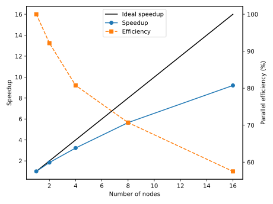

<!--
SPDX-FileCopyrightText: 2010 CSC - IT Center for Science Ltd. <www.csc.fi>

SPDX-License-Identifier: CC-BY-4.0
-->

---
title:  Parallel computing
event:  CSC Summer School in High-Performance Computing 2026
lang:   en
---

# Outline

- Parallel computing concepts
- Parallel performance
- Parallel algorithms
- Parallel programming

# Parallel computing concepts {.section}

# Computing in parallel

<div class=column>
- A problem is split into smaller subtasks
- Multiple subtasks are processed simultaneously using multiple computing units
- Subtasks may need to exchange information and synchronize

</div>
<div class=column>
 {.center width=100%}
</div>

# Compute partitioning and data partitioning

- Compute partitioning
    - Which computing unit calculates what
    - Subtasks may all involve same operations or consist of different operations
- Data partitioning
    - Data may be replicated (or shared) between computing units or distributed between them
        - Often subset of data is shared (e.g. within a node)
    - If data cannot fit to a single node or to a single GPU, distribution is required
- In HPC workloads compute and data are typically aligned

# Static and dynamic partitioning

- Both compute and data partitioning may be either static or dynamic
- Static partitioning
    - Distribution of data and compute tasks is performed at the start of the parallel program
- Dynamic partitioning
    - Distribution of both data and compute may vary during the runtime of the parallel program
- Dynamic partitioning has typically additional overheads and is more complex to implement, but may provide better performance in large scale


# Exposing parallelism: Data parallelism

<div class=column>
- Data parallelism
  - Each computing unit performs simultaneously (nearly) identical operations with different data
  - Data is typically also distributed to computing units
</div>
<div class=column>
 {.center width=70%}
<br>
 {.center width=70%}
</div>


# Exposing parallelism: Tasking

<div class=column>
- Task farm (main / worker)
- Main worker sends tasks to workers and receives results
    - Duty of main worker may be carried out by parallel runtime
- There are normally more tasks than workers, and tasks are assigned dynamically
    - Tasks may be of different nature, and have dependencies between them
</div>
<div class=column>
 {.center width=70%}
<br>

- Video processing pipeline with four stages
    - 1. a task is decoding frame N
    - 2. a task is applying filters to frame N-1
    - 3. a task is encoding frame N-2
    - 4. a task is writing frame N-3 to disk
</div>

# What can be calculated in parallel?

There needs to be independent computations<br><br>

<div class=column>
Gauss-Seidel iteration:
```
while True:
  for i:
    u[i] = (u[i-1] + u[i+1]
            - h**2 * f[i]) / 2

until converged(u)
```

Loop cannot be parallelized over `i` due to data dependency

</div>
<div class=column>
Jacobi iteration:
```
while True:
  for i:
    u_new[i] = (u_old[i-1] + u_old[i+1]
                - h**2 * f[i]) / 2
  swap(u_new, u_old)
until converged(u)
```

Loop can be parallelized over `i`

</div>

# Data dependencies

- When data is distributed, computations may require data from other computing units
    - *Local* dependencies: data is needed only from few other units
    - *Global* dependencies: data is needed from all the computing units
- Dependent data needs to be *communicated* between computing units
    - Time needed for communication is performance overhead

# Data distribution: local vs. global dependencies

<div class=column>
Local dependencies

- Stencils:
<small>
```
v[i,j] = u[i-1, j] + u[i+1, j] + u[i, j-1]
```
</small>

- Finite element methods
- Particle based methods with short range interactions
- Number of communication events per subtask remains constant
</div>
<div class=column>
Global dependencies

- Fourier transform
  $X_k = \sum_{n=0}^{N-1} x_n \exp(-i \frac{2\pi}{N}k \cdot n)$
- Linear algebra: $C = A \times B$

  {.center width=50%}

- Number of communication events per process increases with the number of computing units

# Types of parallel problems

- Tightly coupled
    - Lots of interaction between subtasks
    - Example: Weather simulation
    - Low latency, high speed interconnect is essential
- Embarrassingly parallel
    - Very little (or no) interaction between subtasks
    - Example: Sequence alignment queries for multiple independent sequences in bioinformatics

# Demo: Smooth particle hydrodynamics {.section}

# Parallel performance {.section}

# Performance of parallel programs

- Serial programs have two fundamental performance limits
    - Pure compute performance (CPU clock frequency, vectorization, ...)
    - Memory bandwidth and latency (how fast CPU can access data)
- Performance of parallel programs may be limited also by communication time 

# Parallel scaling

<div class=column>
- Strong parallel scaling
    - Constant problem size
    - Execution time decreases in proportion to the increase in the number of cores / GPUs / nodes
- Weak parallel scaling
    - Increasing problem size
    - Execution time remains constant when the number of cores / GPUs / nodes increases in proportion to the problem size
</div>
<div class=column>

 {.center width=90%}

- Speedup: $S_n = \frac{T_1}{T_n}$
- Parallel efficiency: $E_n = \frac{T_1}{n T_n}$

</div>

# Group work {.section}

# Calculating sum in parallel

<small>

- Task: calculate sum of 20 numbers
- Assumptions:
    - Summing up two numbers takes **1 s** and communicating single number takes **0.1 s**
    - No time is needed for setting up the problem and distributing work
- Work out with pen and paper how much time is needed when the work is performed with 1, 2, 4, and
  8 workers. What is the speed-up with different number of workers?
    - No fancy algorithm for final summation, single worker gathers all the partial results
- Discuss what limits parallel scaling and how parallel efficiency could be improved.
- Does the situation change if the task is to calculate 1020 numbers? What is now
  the parallel speed-up with eight workers?

</small>


# What limits parallel scaling?

- Non-parallelizable parts of problem
- Parallel overheads
    - Additional operations which are not present in serial calculation
    - Communication, synchronization, redundant computations
- Load imbalance
    - Variation in workload over different execution units
- Saturation of shared resources
    - Memory bandwidth within a node
- Too little data to fully occupy a GPU

# Amdahl's law

The fraction of non-parallelizable parts limits the maximum speedup

<div class=column style=width:35%>

<br>
<br>
<br>
<div style=height:2em>
$S_{max} = \frac{1}{\frac{p}{N} + 1-p}$
</div>


</div>
<div class=column style=width:63%>
{.center width=100%}
</div>

# Communication: latency and bandwidth

- Each communication event has a constant cost: latency (µs)
- One should try to communicate large batches of data at once
   - All the boundary data needed within an iteration
   - All the particles needed within an iteration
- Bandwidth (GB/s): maximum transfer speed of (large) data
- Sometimes it is possible to overlap communication and computation
   - Might require proper hardware support

<small>
<div class=column>
```
for iter:
   exchange()
   compute()
```
</div>
<div class=column>
```
for iter:
   exchange_init()
   compute_first()
   exchange_finalize()
   compute_second()
```
</div>
</small>

# Load balance

- If different computing units take different time to complete their subtasks,
  total runtime is determined by the slowest one 
- Load imblance can be caused by by uneven distribution of data or different computational cost of subtasks
- Load balance can change during the simulation, e.g. particles moving from one domain to another
    - Dynamic data and compute partitioning might be needed
- Load balance isssues can be often be alleviated by task based parallelization approaches


# Load balance examples

<small>

<div class=column>
Simple domains with similar computational cost

<br>
{.center width=45%}
<br>

Simple domains with different computational cost

{.center width=35%}
</div>

<div class=column>
Complex FEM meshes
<br>
<br>
{.center width=50%}

<br>
Moving particles
<br>
{.center width=40%}
</div>
</small>


# Parallel algorithms {.section}

# Calculating a sum of numbers

```
  23 + 99 = ...
```

# Calculating a sum of numbers

```
  23 + 99 + 97 + 62 =  ...
```

# Calculating a sum of numbers

```
  23 + 99 + 97 + 62 + 40 + 30 + 72 + 19 + 88 + 12 + 14 + 66 +  4 + 61 + 49 + 58 + 39 + 28 + 86 + 84
= ...
```

# Calculating a sum of numbers

```
  23 + 99 + 97 + 62 + 40 + 30 + 72 + 19 + 88 + 12 + 14 + 66 +  4 + 61 + 49 + 58 + 39 + 28 + 86 + 84
+ 65 + 92 + 49 + 48 + 93 + 75 + 32 + 82 + 92 + 75 + 31 +  8 + 55 + 70 +  1 + 80 + 23 + 78 + 73 + 62
+ 11 + 31 + 99 + 50 + 26 + 82 + 98 + 22 + 82 + 48 + 85 + 69 + 71 + 60 + 27 + 55 + 29 +  7 +  9 + 99
+ 86 + 36 + 95 + 50 + 94 + 87 + 69 +  7 + 59 + 85 + 22 + 50 +  5 + 70 +  5 + 59 + 94 + 69 + 48 + 50
+ 45 + 73 +  2 + 64 + 93 + 50 + 72 +  5 + 66 + 21 + 84 + 33 + 12 + 58 + 35 + 42 + 63 + 33 +  5 + 22
+ 70 + 91 + 71 + 97 + 79 + 13 +  2 +  8 +  3 + 41 + 50 + 74 + 28 + 87 + 39 + 41 +  2 + 72 + 23 + 19
+ 26 + 32 + 64 + 66 + 61 + 29 + 30 + 48 +  8 + 64 + 34 + 75 + 20 +  1 + 97 + 14 + 37 + 46 + 56 + 88
+ 85 + 88 + 79 + 78 + 50 + 25 + 95 + 77 + 17 + 36 + 68 +  3 + 19 + 62 +  1 + 24 + 88 + 33 + 43 + 82
+ 17 + 98 + 20 + 19 + 88 +  8 + 60 + 85 + 35 + 27 + 67 + 77 + 69 + 70 +  2 + 80 + 58 +  1 +  7 + 98
+ 98 + 14 + 41 +  2 + 27 + 73 +  8 + 68 + 43 + 66 + 20 + 52 + 97 + 67 + 42 + 21 + 12 + 37 + 65 + 90
+ 93 + 49 + 25 + 34 + 55 + 77 + 63 +  9 + 75 + 47 + 74 + 80 + 33 + 62 + 62 + 51 + 42 + 29 + 13 + 87
+  4 + 73 + 59 +  5 + 26 + 83 + 90 + 93 + 35 + 81 + 14 + 14 + 53 + 15 + 62 +  3 + 28 + 31 +  8 + 36
+ 48 + 34 + 83 +  8 +  4 + 88 + 84 + 49 + 50 + 10 + 68 + 95 + 31 +  5 + 15 + 32 + 11 + 38 + 43 + 40
+ 76 + 29 + 26 + 66 + 57 + 71 + 30 +  8 + 65 + 10 + 66 + 91 + 23 + 91 + 39 + 93 + 75 + 10 + 32 + 95
+ 41 +  8 + 97 + 63 + 20 + 64 + 10 +  8 +  9 + 76 + 48 + 38 + 76 + 82 + 45 +  8 + 61 + 15 + 89 + 57
+ 93 + 80 + 54 + 53 + 64 +  5 + 68 + 28 + 51 + 66 + 51 + 52 + 72 + 54 + 75 + 24 + 68 + 51 +  7 + 91
+ 34 + 85 + 45 + 99 + 21 + 50 +  9 + 21 + 54 + 57 + 72 + 38 + 66 + 94 + 12 + 86 + 23 +  4 + 55 + 39
= ...
```


# Reductions

- Reduction is an operation that combines data from multiple execution units into a single number
  - Typical reduction operations: **sum**, **product**, **max**, **min**
- Many parallel algorithms need reductions *e.g.* integrals over domains
- Many parallel programming libraries provide efficient implementations for reduction

# Reductions - example algorithms
<div class=column>
<center>
Simple
{.center width=80%}
</center>
</div>
<div class=column>
<center>
Tree
{.center width=80%}
</center>
</div>


# Communication to computation ratio

- Communication to computation ratio is important metric for scalability
  - If ratio increases, algorithm stops scaling with certain number of processors
- Example: domain decomposition of a square grid of dimension $N^2$, $p$ processors
  - Computational cost per process: $T_\text{comp} = \frac{N^2}{p}$

<div class=column>
One dimensional decomposition

- Communication cost of boundary: $T_\text{comm} = N$
- Ratio: $\frac{T_\text{comm}}{T_\text{comp}} = \frac{p}{N}$

</div>
<div class=column>
Two dimensional decomposition

- Communication cost of boundary: $T_\text{comm} = 2\frac{N}{\sqrt{p}}$
- Ratio: $\frac{T_\text{comm}}{T_\text{comp}} = \frac{\sqrt{p}}{2N}$

</div>


# Parallel computing bugs

- Some types of bugs are present only in parallel programs
- Race condition
    - Two (or more) computing units ccess shared data concurrently
    - The final outcome depends on the sequence or timing of execution
    - Unpredictable and often leads to bugs
    - Example: Two threads incrementing the same counter simultaneously might overwrite each other’s result
- Deadlock
    - Two (or more) computing units wait indefinitely for each other to release resources (or e.g. to send data)
    - System halts or stalls due to resource unavailability

# Case study: heat equation {.section}

# Heat equation

- Partial differential equation that describes the variation of temperature in a given region over time
  $$\frac{\partial u}{\partial t} = \alpha \nabla^2 u$$
- Time-dependent temperature field: $u(x, y, z, t)$
- Thermal diffusivity constant: $\alpha$


# Numerical solution

- Discretize: Finite difference Laplacian in two dimensions
  $$
  \begin{align*}
  \nabla^2 u \rightarrow& \frac{u(i-1,j)-2u(i,j)+u(i+1,j)}{(\Delta x)^2} \\
                       +& \frac{u(i,j-1)-2u(i,j)+u(i,j+1)}{(\Delta y)^2}
  \end{align*}
  $$
  {.center width=40%}


# Time evolution

- Explicit time evolution with time step $\Delta t$

  $$u^{m+1}(i,j) = u^m(i,j) + \Delta t \alpha \nabla^2 u^m(i,j)$$

- Note: algorithm is stable only when

  $$\Delta t \leq \frac{1}{2 \alpha} \left(\frac{1}{\Delta x^2} + \frac{1}{\Delta y^2}\right)^{-1} $$

- Given the initial condition ($u(t=0) = u^0$) one can follow the time evolution of the temperature field

# Boundary condition

- The partial differential equation requires boundary condition
    - One possibility: constant temperature at the boundaries (heat bath)
- In numerical solution allocate extra space for the boundaries
  and update only the inner region after initialization

```ruby
allocate( u(Nx + 2, Ny + 2) )
allocate( u_previous(Nx + 2, Ny + 2) )
initialize(u_previous)   # Sets both the initial and the boundary condition

for time in timesteps
  for i in 1..Nx
    for j in 1..Ny
       u(i, j) = u_previous(i, j) + ...
```

# Solving heat equation in parallel

- Temperature at each grid point can be updated independently
- Data can be distributed with domain decomposition
- Data parallel computation: each computing unit works with its own domain

# Solving heat equation in parallel

<div class=column style=width:65%>
- Local data dependency: communication is needed for boundary layers
- Information about neighbouring domains is stored in ”ghost layers”
- Before each update cycle, CPU cores communicate boundary data: **halo exchange**
</div>
<div class=column style=width:33%>
  {.center width=90%}
</div>

# Serial code structure

<pre style="color:black; padding:1ex">

main():
  initialize_field()
  write_field()


  for time in time_steps:
    evolve_field()
    if write_this_time_step:
      write_field()
    swap_fields()

  write_field()
  finalize_field()

</pre>

# Parallel code structure

<pre style="color:black; padding:1ex">
main():
  <span style="color:var(--csc-blue)">initialize_parallelization()</span>
  initialize_field()
  write_field()

  for time in time_steps:
    <span style="color:var(--csc-blue)">halo_exchange_field()</span>
    evolve_field()
    if write_this_time_step:
      write_field()
    swap_fields()

  write_field()
  finalize_field()
  <span style="color:var(--csc-blue)">finalize_parallelization()</span>
</pre>


# Parallel programming models {.section}

# Programming languages

- The de-facto standard programming languages in HPC are (still)
  C/C++ and Fortran
- Higher level languages like Python and Julia are gaining popularity
  - Often computationally intensive parts are still written in C/C++ or Fortran
- Low level GPU programming with CUDA or HIP
- Performance portability (C++) libraries: Kokkos, SYCL, Alpaka, ...
- High-level parallel frameworks: PETSc, Trilinos, ...
- Deep learning libraries: PyTorch, TensorFlow, JAX, ...

# Parallel programming models

- Parallel execution is based on threads or processes (or both) which run at the same time on different CPU cores
- Processes
    - Interaction is based on exchanging messages between processes
    - MPI (Message passing interface), NCCL/RCCL (GPU communication libraries)
- Threads
    - Interaction is based on shared memory, i.e. each thread can access directly other threads data
    - OpenMP, pthreads, CUDA/HIP

# Parallel programming models

 {.center width=80%}
<div class=column>
**MPI: Processes**

- Independent execution units
- MPI launches N processes at application startup
- Works over multiple nodes
</div>
<div class=column>

**OpenMP: Threads**

- Threads share memory space
- Threads are created and destroyed  (parallel regions)
- Limited to a single node

</div>

# GPU programming models

- GPUs are co-processors to the CPU
- CPU controls the work flow:
  - *offloads* computations to GPU by launching *kernels*
  - allocates and deallocates the memory on GPUs
  - handles the data transfers between CPU and GPUs
- GPU kernels run multiple threads
    - Typically much more threads than "GPU cores"
- When using multiple GPUs, CPU runs typically multiple processes (MPI) or multiple threads (OpenMP)

# GPU programming models

{.center width=40%}
<br>

- CPU launches kernel on GPU
- Kernel execution is normally asynchronous
    - CPU remains active
- Multiple kernels may run concurrently on same GPU

# Quiz

TODO menti code

# Summary {.section}

# Summary

- Utilizing supercomputers requires parallel computing
- Parallel performance is measured by speedup/efficiency in strong and weak scaling
    - Good parallel scaling does not imply efficient program!
- Special algorithms may be needed for parallel programs
  - Optimal algorithm for serial execution is not the as the optimal algorithm for parallelized execution
  - Also the hardware target (GPU vs CPU, details of the exact hardware) affect the algorithm choice
- Main parallel programming models include MPI, OpenMP, CUDA/HIP, and higher-level frameworks
