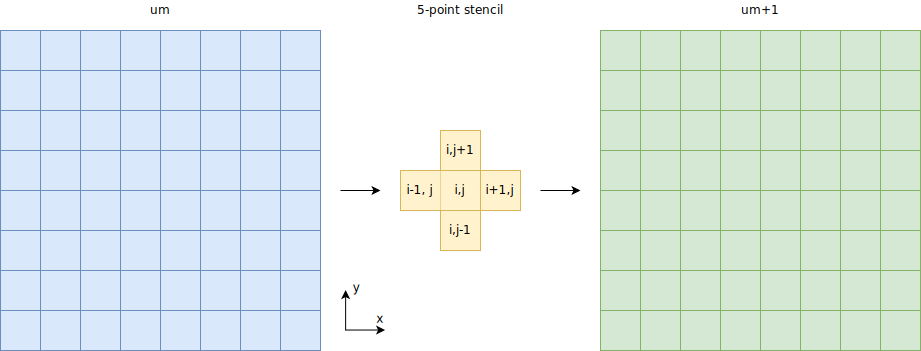
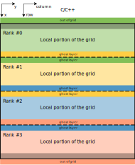
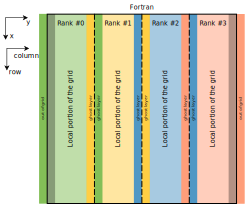

<!--
SPDX-FileCopyrightText: 2010 CSC - IT Center for Science Ltd. <www.csc.fi>

SPDX-License-Identifier: CC-BY-4.0
-->

<!-- Adapted from material by ENCCS -->

# Heat equation in 2D

## Heat diffusion

Heat flows in objects according to local temperature differences, as if seeking local equilibrium.
Such processes can be described with partial differential equations and modeled numerically
via discretization to a regular grid. Solving for the flow over time can involve a lot of
computational effort. Fortunately, the equation governing heat flow is
rather regular and well suited for parallel computations. Throughout the
summer school we will explore various techniques for parallelizing a heat
equation solver.

### Theory

The rate of change of the temperature field $u(x, y, t)$ over two spatial
dimensions $x$ and $y$ and time $t$ with diffusivity constant $\alpha$ can be modelled
via the partial differential equation

$$\frac{\partial u}{\partial t} = \alpha \nabla^2 u$$

where $\nabla^2$ is the Laplacian operator, describing temperature variation
along the spatial dimensions $x$ and $y$. With continuous variables this
equation expands as

$$\frac{\partial u}{\partial t} = \alpha \left( \frac{\partial^2 u}{\partial x^2} + \frac{\partial^2 u}{\partial y^2}\right)$$

In order to model this numerically on a computer we must *discretize* the
equation, meaning that we replace the continuous variables $t, x, y$ with
discrete ones. In practice the spatial dimensions $x, y$ then form a 2D grid
of points which we may label as $(x_i, y_j)$, or just using the integer
indices $i$ and $j$. If the grid spacings in the two dimensions are $\Delta x$ and
$\Delta y$ respectively, the discretized Laplacian reads

```math
\begin{align*}
\nabla^2 u  &= \frac{u(i-1,j)-2u(i,j)+u(i+1,j)}{(\Delta x)^2} \\
 &+ \frac{u(i,j-1)-2u(i,j)+u(i,j+1)}{(\Delta y)^2}
\end{align*}
```
where $u(i,j)$ refers to the temperature at grid point $(x_i, y_j)$.

Given an initial condition ($u(t=0) = u^0$), one can follow the time
dependence of the temperature field from state $m$ to $m+1$ over
regular time steps ∆t with an explicit time evolution method:

$$u^{m+1}(i,j) = u^m(i,j) + \Delta t \alpha \nabla^2 u^m(i,j)$$

Note: This particular time evolution algorithm ("Euler integration") is stable
only when

$$\Delta t \leq \frac{1}{2 \alpha} \left(\frac{1}{\Delta x^2} + \frac{1}{\Delta y^2}\right)^{-1}$$

The discretized heat equation expresses that the time evolution of the temperature
field at a particular location depends on the value of the field at
the previous step at the same location *and* four adjacent locations:



We say that these five grid points form a **stencil** for the time evolution
at point $(i, j)$.


both the "current" and "previous" values of the $u(i, j)$ field, such that
the the

We can iterate the time evolution in code by storing two copies of the
temperature field $u(i, j)$: one for holding the updated values at the timestep
that we are currently computing, and one for holding the field values at the
previous timestep.
In pseudocode, the main simulation loop before parallelization looks roughly
as follows.
```python
main():
  initialize_field()         # Boundary conditions and initial temperature profile on the 2D grid
  write_field()              # Export the temperature field to an external file (.png) for visualization

  for time in time_steps:
    evolve_field()           # Solve temperature field at this timestep based on its values at the previous step
    if write_this_time_step:
      write_field()          # Export again to external file, but do this only at specified intervals
    swap_fields()            # Swap field variables in preparation for the next iteration: "new" field becomes the "previous" field

  # Final export and cleanup
  write_field()
  finalize_field()
```

### Parallelization

The problem can be parallelized by diving the two dimensional
temperature field to different workers, *i.e*. doing domain
decomposition. With shared memory computers the parallelization is
relatively straightforward, however, with distributed memory
parallelization with MPI some extra steps are needed.

Here we describe one-dimensional domain decomposition, meaning that we divide
the spatial $(x,y)$ grid to smaller blocks along either rows or columns, and
assign each block to one worker (MPI task). In practice we will use a 2D array to store
the temperature values, and whether we should distribute blocks of rows or
blocks of columns depends on the memory layout of this array. By "row" we mean
array elements with first index fixed, *i.e.* $(i, 0)$, $(i, 1)$, $(i, 2)$
and so on. "Column" means elements with the second index fixed.

The optimal decomposition will differ for C/C++ and for Fortran. In
C and C++, when you create a 2D array, say `double arr[3][2]`, the memory will
be laid out in *row-major* format. This means that each row `arr[i]` will be a
contiguous block in memory. Therefore, in C/C++, it makes sense to implement
our domain decomposotion using blocks of rows.

In contrast, Fortran uses *column-major* ordering for its 2D arrays: each
column is stored contiguously in memory. Consequently, in Fortran a
column-based decomposition is both easier to implement and more efficient.

The MPI tasks are able to update the grid independently everywhere else than
on the boundaries -- there the communication of a single row (C/C++) or column
(Fortran) with the nearest neighbour is needed. This can be achieved by having additional
ghost-layers that contain the boundary data of the neighbouring tasks. We
assume the system to be non-periodic, so the outermost ranks communicate with
only one neighbour and the inner ranks with two neighbours.





With this parallelization pattern the pseudocode from above is modified to
```python
main():
  initialize_parallelization()  # Init MPI and store info about neighbor domains
  initialize_field()
  write_field()

  for time in time_steps:
    halo_exchange_field()       # Get updated domain boundaries for this rank
    evolve_field()
    if write_this_time_step:
      write_field()
    swap_fields()

  write_field()
  finalize_field()
  finalize_parallelization()    # Cleanup of everything in initialize_parallelization()
```

### Code

The solver carries out the time development of the 2D heat equation over the
number of time steps provided by the user. The user can configure the grid
size and initial conditions of the temperature field, in other words, what kind
of geometry is present in the system. By default the program places a solid circle
at middle of the grid but other shapes may be used via input files. A bottle
is given as an example at [bottle.dat](../../../heat-shared/data/bottle.dat).

Examples on how to run the binary:
- `./heat`  (no arguments - the program will run with the default arguments:
             2000x2000 grid and 500 time steps)
- `./heat bottle.dat` (one argument - start from a temperature grid provided
                       in the file `bottle.dat` for the default number of time
                       steps)
- `./heat bottle.dat 1000` (two arguments - will run the program starting from
                            a temperature grid provided in the file
                            `bottle.dat` for 1000 time steps)
- `./heat 4000 8000 1000` (three arguments - will run the program in a
                           4000x8000 grid for 1000 time steps)

The program will produce an image (PNG) of the temperature field after every
500 iterations. You can change the frequency by modifying the parameter
`image_interval` in [main.c](cpp/main.cpp) (or [main.F90](fortran/main.F90)).
You can also visualize the images e.g. with
`animate -resize 25% -delay 100 heat_*.png` or `eog heat_0100.png`.

